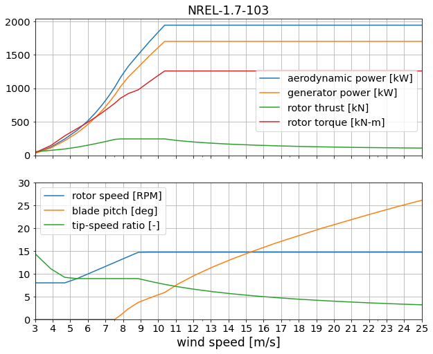

# NREL 1.7-103 - _UNDER DEVELOPMENT_

Design by [Eliot Quon](mailto:eliot.quon@nrel.gov), Pietro Bortolotti, and John Jasa

| Design Variable        | Value    | Description |
| ---------------------- | -------- | ----------- |
| rated electrical power | 1.7 MW   | specified |
| diameter               | 103 m    | specified |
| tower height           | 80 m     | specified |
| tip-speed ratio        | 9.0      | estimate, increased from IEA-3.4-130 (TSR=8.02) |
| minimum rotor speed    | 8 RPM    | estimate, increased from IEA-3.4-130 (6.9 RPM) |
| maximum rotor speed    | 15.8 RPM | estimate, increased from IEA-3.4-130 (12.1 RPM) |
| rated tip speed        | 85 m/s   | estimate |
| peak shaving           | 30%      | estimate |

Performance table `NREL-1.7-103.csv` generated by `WISDEM/check_NREL-1p7-103.ipynb`.

## Design approach

* Start with IEA-3.4-130 reference model
* Adjust rotor size, rated power, and tower height
* Perform twist optimization for max AEP
* Perform twist and chord optimization for max AEP, with max chord and stall constraints
* Perform twist and chord optimization for max AEP, with thrust shaving
* Perform spar cap optimization for min blade mass
* Perform tower layer thickness and diameter optimization for min tower mass

## Reference data

* P, Cp, Ct for GE-1.6-100 from
  https://en.wind-turbine-models.com/turbines/370-ge-general-electric-ge-1.6-100
  (accessed 2020-11-28)
* P cross-referenced with
  https://www.thewindpower.net/turbine_en_355_ge-energy_1.7-103.php
  (accessed 2021-02-22)
* P cross-referenced with
  https://www.thewindpower.net/turbine_en_593_ge-energy_1.7-100.php
  (accessed 2021-02-22)
