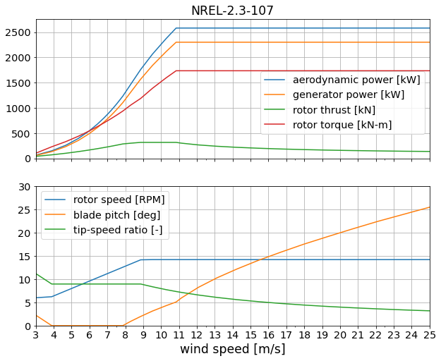

# NREL 2.3-107

Design by [Eliot Quon](mailto:eliot.quon@nrel.gov)

| Design Variable        | Value  | Description |
| ---------------------- | ------ | ----------- |
| rated electrical power | 2.3 MW | specified |
| diameter               | 107 m  | specified |
| tower height           | 80 m   | specified |
| tip-speed ratio        | 9.0    | estimate, from NREL-2.5-116 |
| minimum rotor speed    | 8 RPM  | estimate, from NREL-2.5-116 |
| maximum rotor speed    | 14 RPM | estimate, from NREL-2.5-116 |
| rated tip speed        | 85 m/s | estimate |
| peak shaving           | 25%    | estimate |

Performance table `NREL-2.3-107.csv` generated by `WISDEM/check_NREL-2p3-107.ipynb`.

## Design approach

* Start with NREL-2.3-107 reference model
* Adjust rotor size, rated power, and tower height
* Perform twist optimization for max AEP
* Perform twist and chord optimization for max AEP, with max chord and stall constraints
* Perform twist and chord optimization for max AEP, with thrust shaving
* Perform spar cap optimization for min blade mass
* Perform tower layer thickness and diameter optimization for min tower mass

## Reference data

* n/a
