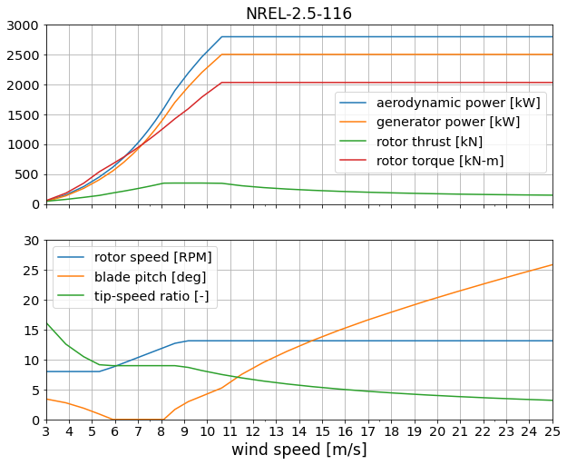

# NREL 2.5-116

Design by [Eliot Quon](mailto:eliot.quon@nrel.gov) and Pietro Bortolotti

| Design Variable | Value | Description |
| --------------- | ----- | ----------- |
| rated electrical power | 2.5 MW | specified |
| diameter | 116 m | specified |
| hub radius | 2 m | same as IEA-3.4-130 |
| tower height | 80 m | specified |
| tip-speed ratio | 9.0 | estimate, increased from IEA-3.4-130 (TSR=8.02) |
| cut-in wind speed | 3 m/s | specified |
| rated wind speed | 10.5 m/s | target |
| cut-out wind speed | 25 m/s | specified |
| peak shaving | 25% | estimate |

Design approach:

* Start with IEA-3.4-130 reference model
* Adjust rotor size, rated power, and tower height
* Perform unconstrained twist optimization for max AEP
* Perform twist and chord optimization for max AEP, with max chord and stall constraints
* Perform spar cap optimization for min blade mass
* Perform tower layer thickness optimization for min tower mass

Reference data:

* P, Cp, Ct for GE-2.5-120 from
  https://en.wind-turbine-models.com/turbines/310-ge-general-electric-ge-2.5-120
  (accessed 2020-11-23)
* P cross-referenced with
  https://www.thewindpower.net/turbine_en_592_ge-energy_2.5-120.php
  (accessed 2020-11-23)
