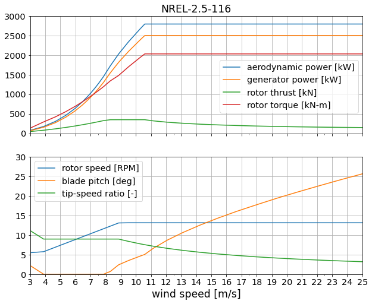

# NREL 2.5-116

Design by [Eliot Quon](mailto:eliot.quon@nrel.gov), Pietro Bortolotti, and John Jasa

| Design Variable        | Value  | Description |
| ---------------------- | ------ | ----------- |
| rated electrical power | 2.5 MW | specified |
| diameter               | 116 m  | specified |
| tower height           | 80 m   | specified |
| tip-speed ratio        | 9.0    | estimate, increased from IEA-3.4-130 (TSR=8.02) |
| minimum rotor speed    | 5.5 RPM| estimate for soft-stiff tower |
| maximum rotor speed    | 14 RPM | estimate based on Vtip |
| rated tip speed        | 85 m/s | estimate |
| peak thrust shaving    | 75%    | estimate |

Performance table `NREL-2.5-116.csv` generated by `WISDEM/check_NREL-2p5-116.ipynb`.

## Design approach

* Start with IEA-3.4-130 reference model
* Adjust rotor size, rated power, and tower height
* Perform twist optimization for max AEP
* Perform twist and chord optimization for max AEP, with max chord and stall constraints
* Perform twist and chord optimization for max AEP, with thrust shaving
* Perform spar cap optimization for min blade mass
* Perform tower layer thickness and diameter optimization for min tower mass

## Reference data

* P, Cp, Ct for GE-2.5-120 from
  https://en.wind-turbine-models.com/turbines/310-ge-general-electric-ge-2.5-120
  (accessed 2020-11-23)
* P cross-referenced with
  https://www.thewindpower.net/turbine_en_592_ge-energy_2.5-120.php
  (accessed 2020-11-23)
