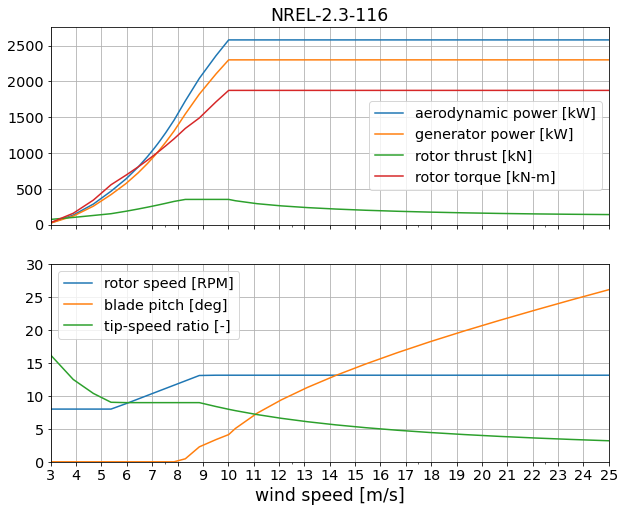

# NREL 2.3-116

Design by [Eliot Quon](mailto:eliot.quon@nrel.gov)

| Design Variable        | Value    | Description |
| ---------------------- | -------- | ----------- |
| rated electrical power | 2.3 MW   | specified |
| diameter               | 116 m    | specified |
| tower height           | 80.0 m   | specified |
| tip-speed ratio        | 9.0      | from NREL-2.5-116 |
| minimum rotor speed    | 8.0 RPM  | estimate, increased from NREL-2.5-116 |
| maximum rotor speed    | 14.0 RPM | from NREL-2.5-116 |
| rated tip speed        | 85 m/s   | estimate |
| peak thrust shaving    | 78.8%    | estimate |

Performance table `NREL-2.3-116.csv` generated by `WISDEM/check_NREL-2p3-116.ipynb`.

## Design approach

* Start with NREL-2.5-116 model
* Adjust rated power
* Perform twist optimization for max AEP
* Perform twist and chord optimization for max AEP, with max chord and stall constraints
* Perform twist and chord optimization for max AEP, with thrust shaving
* Perform spar cap optimization for min blade mass
* Perform tower layer thickness and diameter optimization for min tower mass

## Public reference data

* n/a

